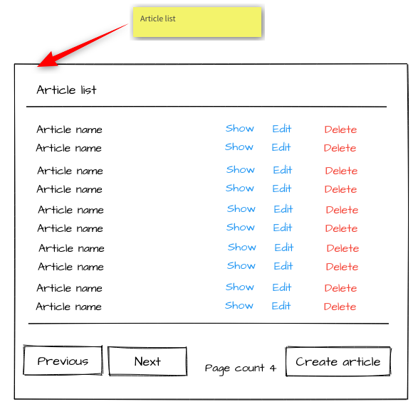
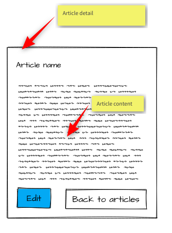
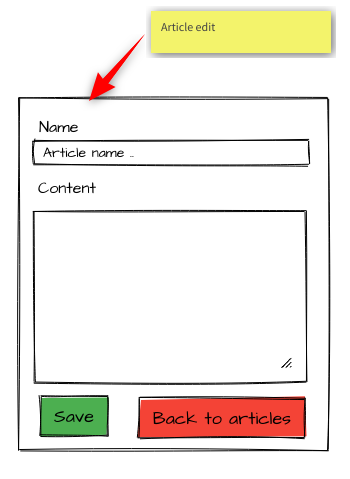

# Příprava na programátorský test

Cílem je vyvinout jednoduchou webovou aplikaci v PHP a JavaScriptu umožňující editaci a zobrazení článků.
Vytvořenou aplikaci je nutné nasadit na adresu ```https://webik.ms.mff.cuni.cz/~{user-id}/cms/```, kde ```{user-id}``` je Vaše uživatelské jméno.

Změny: 
 * 2021.12.11
 * 2021.01.06 - úprava stringu pro připojení k DB
 * 2021.01.20 - update .htaccess
 
## Funkcionální požadavky
Z hlediska funkcionality lze aplikaci rozdělit na několik částí: seznam článků, detail článku a editace článku.
V rámci aplikace neřešte synchronizaci dat pro více uživatelů/klientů. 

### Seznam článků
Seznam článků je dostupný na URL ```./articles``` a pokrývá zejména následující funkcionalitu:

* F01) Uživatel může zobrazit stránkovaný seznam článků přístupem na URL ```./articles```.
  Každá stránka obsahuje nejvýše 10 článků.
* F02) Uživatel se může pohybovat po stránkách pomocí tlačítek ```Next``` a ```Previous```.
* F03) Pokud je uživatel na první/poslední stránce je tlačítko ```Previous```/```Next``` skryté.
* F04) Na stránce je zobrazen aktuální počet stránek.
* F05) Pro každý článek je v seznamu zobrazen jeho název.
* F06) Pro každý článek je v seznamu zobrazen odkaz s textem ```Show```.
  Po kliknutí na odkaz je uživateli zobrazen detail daného článku - URL ```./article/{id}```.
* F07) Pro každý článek je v seznamu zobrazen odkaz s textem ```Edit```.
  Po kliknutí na odkaz je uživateli zobrazena editace daného článku - URL ```./article-edit/{id}```.
* F08) Pro každý článek je v seznamu zobrazen odkaz s textem ```Delete```.
  Po kliknutí je článek smazán a seznam článků aktualizován. 
  Po aktualizaci zůstává uživatel na stejné stránce seznamu, pokud to není možné je zobrazena stránka poslední.
  Mazání je nutné realizovat pomocí technologie AJAX s HTTP metodou DELETE.
  Aktualizaci je nutné provést pouze pomocí JavaScriptu, 
  stránka nesmí být celá znovu načtena ze serveru.
* F09) Na stránce je zobrazeno tlačítko s textem ```Create article```.
* F10) Po kliknutí na tlačítko ```Create article```, je zobrazen dialog.
  V dialogu je textové pole s popiskem ```Name```, kam může uživatel zadat jméno nového článku. 
  Po zobrazení dialogu je textové pole prázdné a jeho délka je omezena na 32 znaků.
  Dialog obsahuje tlačítka ```Create``` a ```Cancel```.  
  * F11) Po kliknutí na tlačítko ```Cancel``` je dialog zavřen a nedojde k žádné změně.
  * F12) Tlačítko ```Create``` je možné zmáčknout pouze, pokud je vyplněn název článku.
  * F13) Po kliknutí na tlačítko ```Create``` je vytvořen nový článek s daným názvem a prázdným obsahem.
    Uživatel je následně přesměrován na editaci vytvořeného článku.

### Detail článku
Detail článku je dostupný na URL ```./article/{id}```, kde ```{id}``` je identifikátor článku. 
Detail článku pokrývá následující funkcionalitu: 

* F14) Uživatel může zobrazit detail článku přístupem na URL ```./article/{id}```, kde ```{id}``` je platný identifikátor článku.  
* F15) Pokud článek s daným ```{id}``` neexistuje je vrácen prázdný dokument s kódem 404.
* F16) Pokud článek existuje je zobrazen název článku, popis článku, tlačítko ```Edit``` a tlačítko ```Back to articles```.
  * F17) Po stisknutí tlačítka ```Edit``` je uživatel přesměrován na editaci daného článku - URL ```./article-edit/{id}```.
  * F18) Po stisknutí tlačítka ```Back to articles``` je uživatel přesměrován na první stránku v seznamu článků.
    

### Editace článku
Editace článku je dostupná na URL ```./article-edit/{id}```, kde ```{id}``` je identifikátor článku. 
Editace článku pokrývá následující funkcionalitu: 

* F19) Uživatel může zobrazit editaci článku přístupem na URL ```./article-edit/{id}```, kde ```{id}``` je platný identifikátor článku.  
* F20) Pokud článek s daným ```{id}``` neexistuje je vrácen prázdný dokument s kódem 404.
* F21) Pokud článek existuje je zobrazen editační formulář, tlačítko ```Save``` a tlačítko ```Back to articles```.
* F22) Po stisknutí tlačítka ```Back to articles``` je uživatel přesměrován na první stránku v seznamu článků.
* F23) Editační formulář obsahuje text input pro název formuláře s popiskem ```Name```, textarea pro obsah článku s popiskem ```Content```.
  Počet znaků v textarea je limitován na 1024. Počet znaků v text input je limitován na 32.
* F24) Tlačítko ```Save``` je _funkční%, pouze pokud je text input (```Name```) neprázdný.
  Pokud je prázdný, tlačítku buď není možné stisknout, nebo jeho stisknutí nevede k žádné akci.
  Ve druhém případě je třeba uživatele vhodně upozornit na důvody.
* F25) Po stisknutí tlačítka ```Save``` jsou změny v článku uloženy a uživatel je přesměrován na první stránku v seznamu článků.
 
## Nefunkční požadavky
* N01) Aplikace nesmí používat žádné knihovny ani kusy kódu/stylu třetích stran. 
  Pokud hodláte využít jazyka transpilovaného do JavaScriptu (například TypeScript) dejte ná vědět, abychom dohodli podmínky použití.  
  Nezávazně lze říci, že použití, zejména, TypeScriptu je povolené s vhodným nastavením překladu.
  V takovém případě je povolené odevzdat (do)generovaný kód.
* N02) Články jsou uloženy do SQL databáze. 
* N03) Přístupové údaje do databáze jsou načteny ze souboru ```db_config.php```, který odpovídá následujícímu vzoru.
```
<?php
  $db_config = array(
    'server'   => 'localhost',
    'login'    => '<my-username>',
    'password' => '<my-password>',
    'database' => 'stud_<my-username>',
   );
```
* N04) Stránka pro zobrazení detailu článku musí být renderována kompletně na straně serveru.
  ~~a nesmí obsahovat žádný _funkční_ JavaScript~~.
* N05) Stránka pro editaci článku musí být renderována na straně serveru.
  ~~a nesmí obsahovat žádný _funkční_ JavaScript~~
* N05) Stránka pro seznam článků je renderována na straně serveru a obsahuje všechny články.
  Stránkování a zobrazení dialogu pro vytvoření nového záznamu je řešeno na straně klienta pomocí JavaScriptu.
* N06) PHP aplikace musí vyžívat návrhového vzoru front-controller.
Pro implementaci na Webíku je možné použít třeba ```.htaccess``` o následujícím obsahu uložený k ```index.php``` souboru Vaší aplikace (je třeba změnit skoda na Vaše uživatelské jméno):
```
RewriteEngine On
RewriteBase /~skoda/cms/

RewriteCond %{REQUEST_URI} !index\.php
RewriteRule ^([-a-zA-Z0-9_/]+)$ index.php?%{QUERY_STRING}&page=$1 [L]
```
* N07) Stránka musí být vhodně ostylována na základě mockups.




## Data
Data jsou uložena v relační databázi MySQL.
Schema musí obsahovat tabulku ```articles```, ve které jsou uloženy jednotlivé články. 
Tabulka musí obsahovat sloupce ```name``` a ```content```ve kterých je uložen název a obsah článku.

Pro účely demonstrace je vhodné do databáze připravit ukázková data, zejména pro stránkování.

## Upřesnění hodnocení
Hlavním kritériem hodnocení je funkčnost. 
Vaše zápočtová práce musí implementovat všechny výše uvedené funkce, jak bylo popsáno, jinak nebude akceptována.
Od specifikace je možné se odchýlit, pokud bude zachován zamýšlený rozsah testovaných znalostí a dovedností, jejichž zvládnutí má student v této práci demonstrovat.

Při implementaci zejména dbejte na následující podmínky:
- Validní HTML a CSS u všech stránek.
- Systematické řešení pro vkládání dat do HTML (šablon), které zabrání script-injection.
- Systematické řešení pro práci s databází, které zabrání SQL-injection.
- Formuláře vhodně validují vstupy pomocí HTML5 atributů.
- Všechny uživatelské vstupy a data by měla být validována nebo sanitizována.
- Všechny chyby jsou přiměřeným způsobem zobrazeny uživateli.
- Vhodný code-style a pojmenování funkcí/proměnných.
